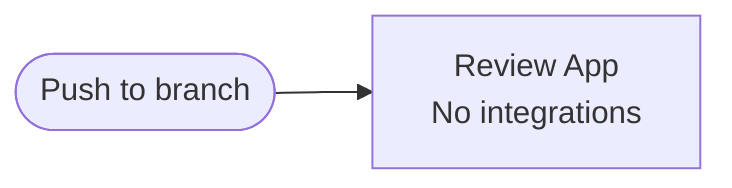
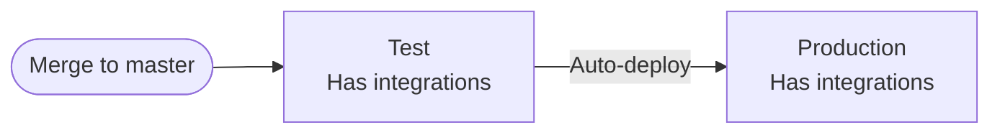
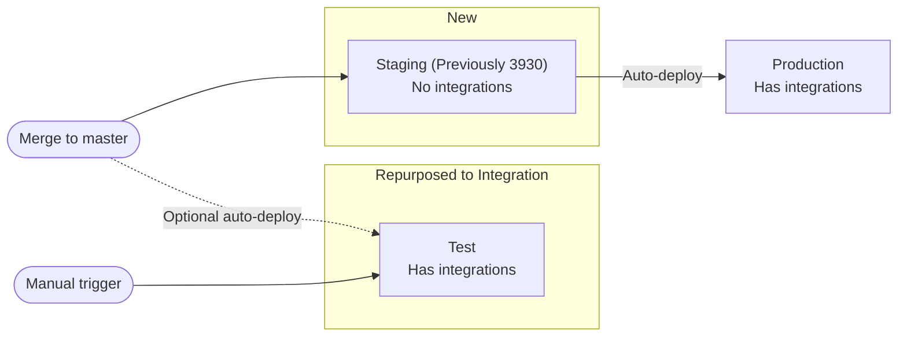

# CI/CD Pipeline changes to incorporate a Staging environment

## Current Pipeline

---

### Feedback

- We're not really using test because it's in the production pipeline and whatever we deploy there also has to be deployed to production.
- It has the integrations we actually want to use but due to the previous point it's awkward.
- Ideally Test should be our "3930" Review App, but we didn't want the integrations, testing with preprod OL, TRS is a pain for everyday business review and we prefer bypass and stubs.
- "3930" we always wanted it to have the lastest version, same as production.
- Have a long-running "3930" isn't ideal:
    - it can get closed changing the URL
    - malware scanning needs reprovisioning by DevOps
    - review apps are stopped after a few days and need "touching" to re-deploy them.

---

## Proposed Pipeline

### Incorporating that feedback

